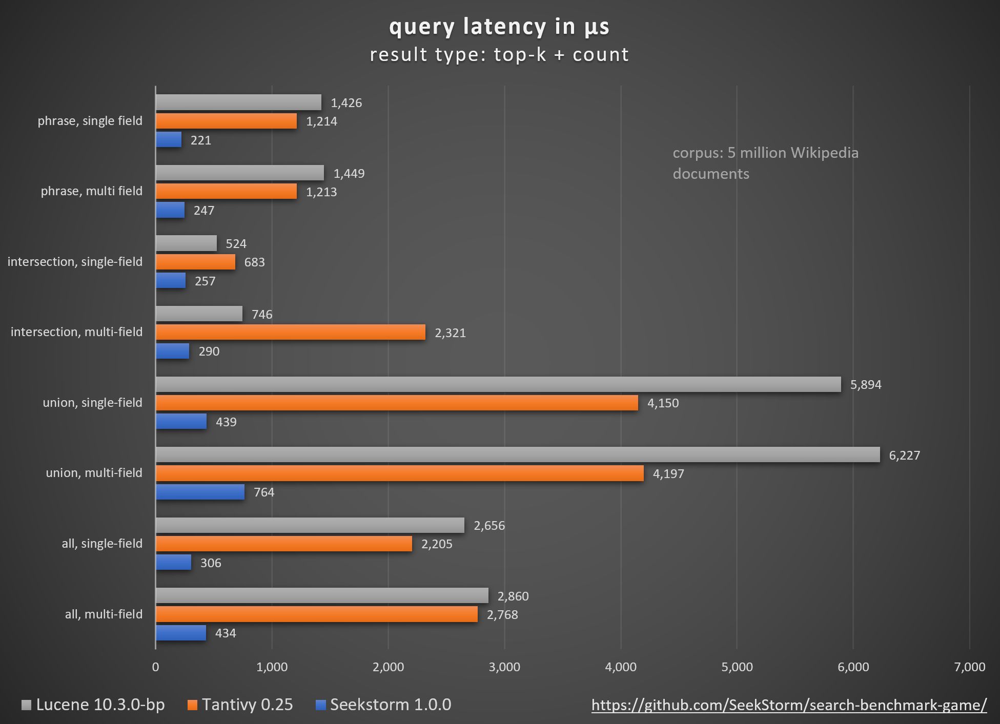
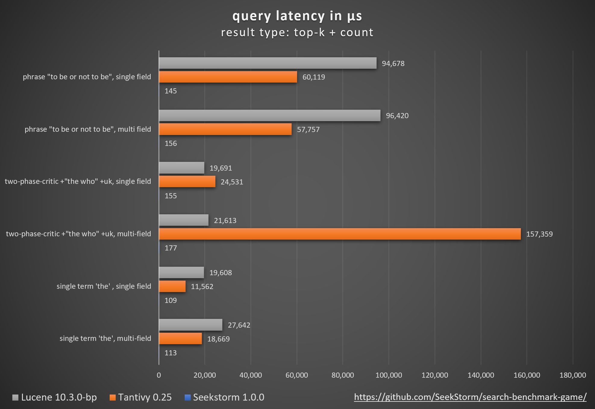
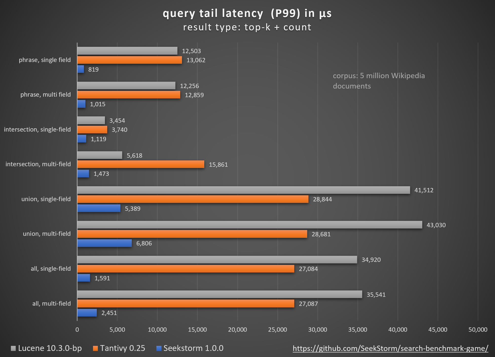

search_benchmark_game
====
### Search engine benchmark: SeekStorm, Tantivy, Lucene, ...

Open-source search engine libraries (BM25 lexical search) are compared using the open-source search_benchmark_game developed by [Tantivy](https://github.com/quickwit-oss/search-benchmark-game/) and [Jason Wolfe](https://github.com/jason-wolfe/search-index-benchmark-game).

[Detailled benchmark results for multifield search](/search-benchmark-game-multifield/)

[Detailled benchmark results for singfield search](/search-benchmark-game-singlefield/)

[Benchmark code repository](https://github.com/SeekStorm/search-benchmark-game)

 
 

 
 

 
 

### Multi field search vs. single field search

Many benchmarks focus on search within a single field, but in real-world use cases, we often need to search through multiple fields at the same time. 

How much this influences the performance, depends on the used data structures and algorithms of the search library.

Multi-field search at little additional cost is desirable, but can’t be taken for granted with every search library.

Often, the number of terms in the (e.g.) title field is negligible compared to the (e.g.) body field, yet searching through both fields can be expensive in some search libraries.

Btw., concatenating both fields before indexing is not a viable solution because it prohibits both field filtering and BM25F scoring, where matches in a shorter title field should receive a higher score.

### Benefits of search_benchmark_game
+ using a proven open-source benchmark used by other search libraries for comparability
+ adapters writtten mostly by search library authors themselves for maximum authenticity and faithfulness
+ results can be replicated by everbody on their own infrastructure
+ detailed results per query, per query type and per result type to investigate optimization potential

### About the results

This benchmark is not meant to be a leaderboard, but when every library is "lightning-fast" or  "blazingly fast", it is interesting to see how they stack up against each other. That is helpful not only for the users, 
but also for the developers to assess unused optimization potential.

Results will vary - depending on your hardware, OS, concurrent OS activity, JVM, environment temperature, query set, and document corpus...

Before making any decisions, you should always replicate the tests on your infrastructure for your specific workload.

Query latency is only one aspect of search - relevancy, functionality, scalability, and ease of use are equally important.

